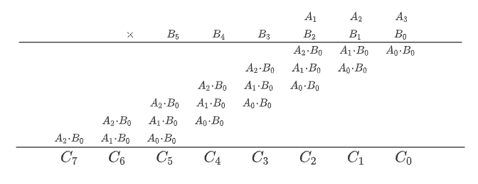

# 알고리즘 문제해결전략

## 분할 정복

### 카라츠바 알고리즘


a, b는 256자리 숫자 a의 앞 128자리가  뒤의 128자리가  이다. b도 같은 방법으로 나눈 것

```c++
z2 = a1 * b1;
z0 = a0 * b0;
z1 = (a0 + a1) * (b0 + b1) - z0 - z2;
```

위와 같이 4번의 곱셈을 세번의 곱셈으로 줄일 수 있다. 

z2, z0, z1도 재귀적으로 호출한다. 


### 문제: 팬미팅

<p align="center">
    
</p>

**문자열 예시**

```
MFMFMFFFMMMFMF
MMFFFFFMFFFMFFFFFFMFFFMFFFFMFMMFFFFFFF
```

> **조건:** M은 F와 만나고, F는 M이나 F 둘 다 상관이 없다. 

아래 문자열을 위 문자열의 오른쪽 끝에서 한 칸씩 왼쪽으로 이동하며 모든 위 문자열의 문자에 대해 조건이 만족하는 경우의 수를 찾는 문제.

M을 1, F를 0으로 놓고 두 수를 곱한 결과를 자리올림을 무시하고 계산하면 M과 M이 곱해지는 경우만 1이기 때문에, 각각의 자리가 해당하는 경우에 대해 M과 M이 만나는 횟수를 의미한다. 따라서 0인 자릿수의 개수가 문제의 답이 된다.  

<p align="center">
    
</p>


