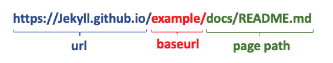

# URL

## URL sturcture

url과 baseurl은 **_config.yml**에서 설정

`{{ page.path | prepend: site.base url }}`

각 페이지로 이동할 때 위와 같이 적어주면 올바르게 path를 설정할 수 있다.

## Permalink

permalink는 **Front Matter**의  variable 중 하나로 위의 URL structure에서 page path에 해당하는 부분을 원하는 대로 customize 가능하게 해준다. 

예를 들어,`permalink: /` 라고 쓰면 baseurl 까지만 썼을 때의 default page가 해당하는 page가 되고, index.html에 `permalink: /home/` 이라고 쓰면 page path에 /home/이라고 썼을 때 page가 index.html이 된다. 

